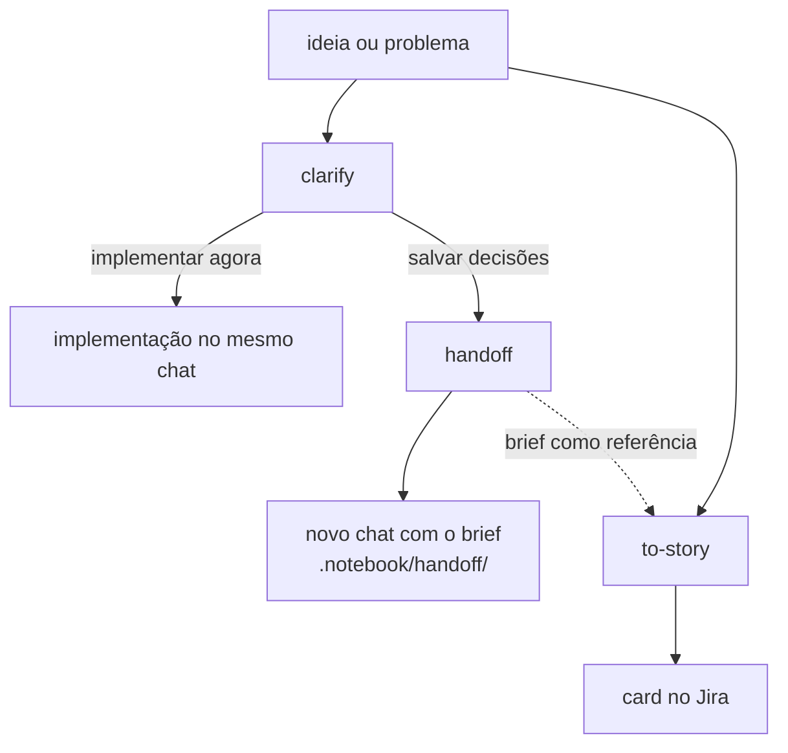

# ia-stuff

Pacote de skills de IA. Tudo fica em `skills/`.

As skills trabalham dentro do mesmo ecossistema: uma alimenta a outra, e toda saída que precisa ser gravada vai por padrão para a pasta `.notebook/` na raiz do projeto que as consome. Assim um brief do `handoff` fica num lugar previsível, onde outras skills e sessões podem encontrá-lo.

**Algumas skills são pessoais; outras são forks de skills já existentes, adaptadas para o meu dia a dia.**

## Skills

- **`clarify`** — Entrevista sem trégua, em rodadas (árvore de design + fronteira), até o entendimento compartilhado. Só com invocação explícita.
- **`handoff`** — Salva o contexto da conversa atual e as decisões tomadas para você retomar o trabalho num novo chat, com a janela de contexto limpa. Pode ser usado em qualquer conversa, não só depois de um clarify.
- **`to-story`** — Transforma um dump de discovery, texto de agente, card do Jira ou uma ideia de uma linha numa história curta e legível. Só com invocação explícita.
- **`explain-pr`** — Percorre um PR ou MR como aula, um item por vez: a base, depois cada conceito, depois como as peças se ligam. Explica o que foi feito, não é um code review. Só com invocação explícita.
- **`humanizer`** — Reescreve texto com cara de IA para soar como quem escreveu, sem mudar o que o texto diz.

## Layout do `.notebook/`

```
.notebook/
└── handoff/                     # briefs do handoff
    └── dd-mm-yy-tema.md
```

## Fluxo geral



1. **`clarify`** quando a ideia ainda precisa de um entendimento compartilhado.
2. Ao fim do clarify, implemente direto no mesmo chat ou use o **`handoff`** para continuar em outro.
3. **`handoff`** em qualquer conversa atual — uma sessão de clarify ou qualquer outro chat — para abrir um novo chat com o mesmo contexto e as decisões registradas.
4. **`to-story`** para transformar a ideia, um brief do handoff ou um dump de discovery num card do Jira.

## Modos do `to-story`

Na invocação, o `to-story` procura uma ferramenta de Jira nesta ordem e usa a primeira instalada e autenticada: `twg`, `acli`, depois um MCP da Atlassian.

| Modo | Quando | Entrega |
| --- | --- | --- |
| **Jira** | Uma ferramenta foi encontrada | Mostra o card e sempre pede aprovação antes de gravar |
| **Markdown** | Nenhuma foi encontrada | Mostra o card e um bloco para copiar e colar |

A prosa usa a skill `humanizer` quando ela está disponível, com um checklist embutido como fallback.
