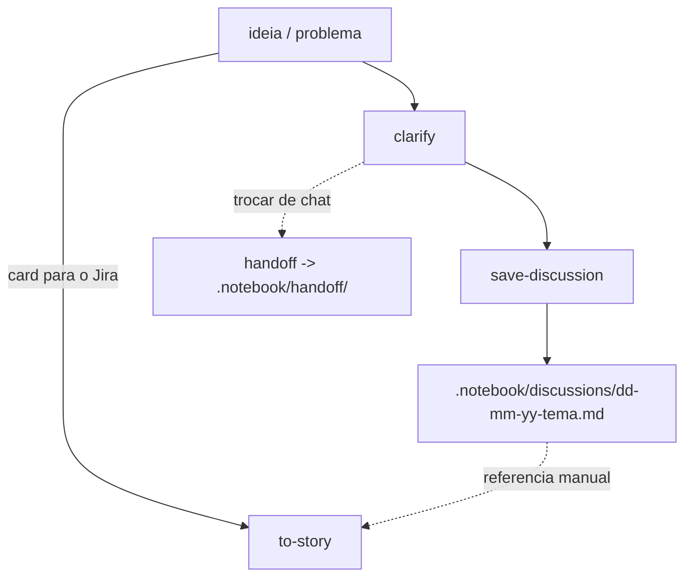

# ia-stuff

AI skills pack. Everything lives under `skills/`; runtime outputs go to `.notebook/` in the consuming project.

## Skills

| Skill | What it does | Writes |
| --- | --- | --- |
| `clarify` | Relentless interview in rounds (design tree + frontier) until shared understanding. Explicit invocation only. | nothing |
| `save-discussion` | After a clarify, persist settled decisions for **this discussion**. | `.notebook/discussions/dd-mm-yy-tema.md` |
| `handoff` | Compact the current conversation into a brief for another session/agent. | `.notebook/handoff/dd-mm-yy-tema.md` |
| `to-story` | Turn a discovery dump, agent text, Jira card, or one-line idea into a short human-readable story. Explicit invocation only. | Jira card, only after explicit approval |

## `.notebook/` layout

```
.notebook/
├── discussions/                 # save-discussion outcomes
│   └── dd-mm-yy-tema.md
└── handoff/                     # handoff briefs
    └── dd-mm-yy-tema.md
```

## Overall flow



1. **`clarify`** when the idea still needs a clear shared understanding.
2. **`save-discussion`** when the frontier is empty — writes the discussion note.
3. **`handoff`** to carry the conversation into another chat or agent.
4. **`to-story`** to turn the idea, a discussion note, or a discovery dump into a Jira card.

## `to-story` modes

On invocation, `to-story` checks for a Jira tool in this order and uses the first one installed and authenticated: `twg`, `acli`, then an Atlassian MCP.

| Mode | When | Delivery |
| --- | --- | --- |
| **Jira** | A tool was found | Shows the card, then always asks for approval before writing it |
| **Markdown** | Nothing was found | Shows the card plus a Copy & Paste block |

Its prose relies on the `humanizer` skill when available, with a built-in checklist as fallback.
