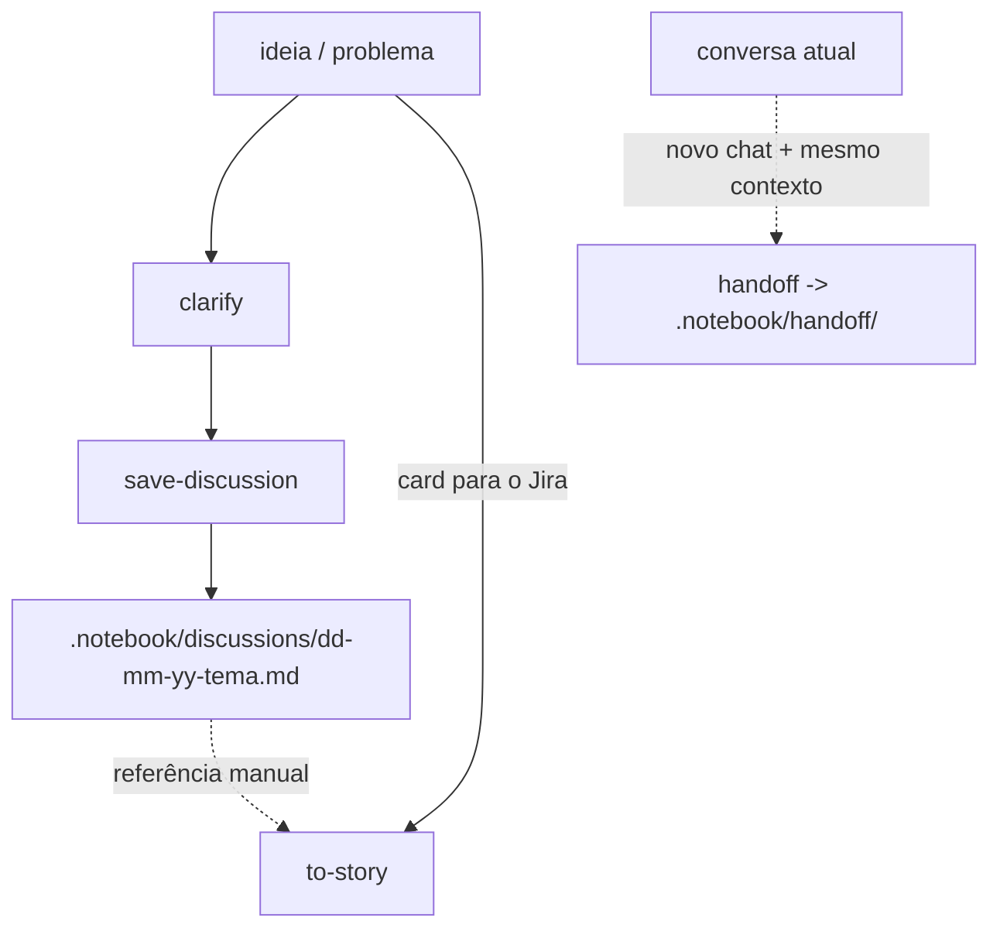

# ia-stuff

Pacote de skills de IA. Tudo fica em `skills/`; o que a skill grava em tempo de execução vai para `.notebook/` no projeto que a consome.

## Skills

- **`clarify`** — Entrevista sem trégua, em rodadas (árvore de design + fronteira), até o entendimento compartilhado. Só com invocação explícita.
- **`save-discussion`** — Depois de um clarify, persiste as decisões fechadas **desta discussão**.
- **`handoff`** — Compacta a conversa atual num brief para outra sessão ou outro agente.
- **`to-story`** — Transforma um dump de discovery, texto de agente, card do Jira ou uma ideia de uma linha numa história curta e legível. Só com invocação explícita.
- **`explain-pr`** — Percorre um PR ou MR como aula, um item por vez: a base, depois cada conceito, depois como as peças se ligam. Explica o que foi feito, não é um code review. Só com invocação explícita.

## Layout do `.notebook/`

```
.notebook/
├── discussions/                 # resultados do save-discussion
│   └── dd-mm-yy-tema.md
└── handoff/                     # briefs do handoff
    └── dd-mm-yy-tema.md
```

## Fluxo geral



1. **`clarify`** quando a ideia ainda precisa de um entendimento compartilhado.
2. **`save-discussion`** quando a fronteira está vazia — grava a nota da discussão.
3. **`handoff`** em qualquer conversa atual — uma sessão de clarify ou qualquer outro chat — para abrir um novo chat com o mesmo contexto.
4. **`to-story`** para transformar a ideia, uma nota de discussão ou um dump de discovery num card do Jira.

## Modos do `to-story`

Na invocação, o `to-story` procura uma ferramenta de Jira nesta ordem e usa a primeira instalada e autenticada: `twg`, `acli`, depois um MCP da Atlassian.

| Modo | Quando | Entrega |
| --- | --- | --- |
| **Jira** | Uma ferramenta foi encontrada | Mostra o card e sempre pede aprovação antes de gravar |
| **Markdown** | Nenhuma foi encontrada | Mostra o card e um bloco para copiar e colar |

A prosa usa a skill `humanizer` quando ela está disponível, com um checklist embutido como fallback.
