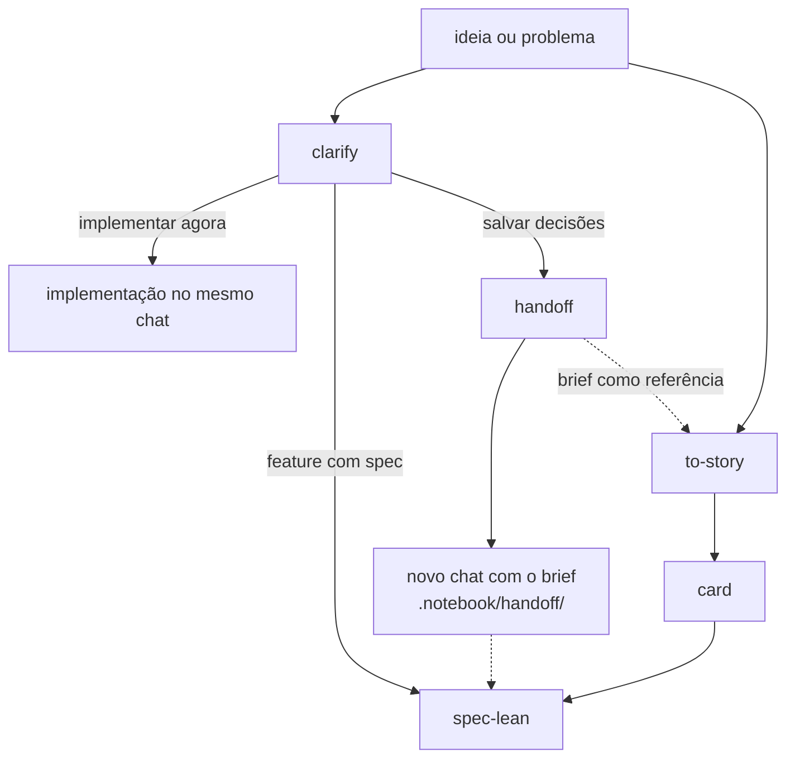

# ia-stuff

Pacote de skills de IA. Tudo fica em `skills/`.

As skills trabalham dentro do mesmo ecossistema: uma alimenta a outra, e toda saída que precisa ser gravada vai por padrão para a pasta `.notebook/` na raiz do projeto que as consome. Assim um brief do `handoff` fica num lugar previsível, onde outras skills e sessões podem encontrá-lo.

**Algumas skills são pessoais; outras são forks de skills já existentes, adaptadas para o meu dia a dia.**

## Skills

- **`clarify`** — Entrevista sem trégua, em rodadas (árvore de design + fronteira), até o entendimento compartilhado. Só com invocação explícita.
- **`handoff`** — Salva o contexto da conversa atual e as decisões tomadas para você retomar o trabalho num novo chat, com a janela de contexto limpa. Pode ser usado em qualquer conversa, não só depois de um clarify.
- **`to-story`** — Transforma um dump de discovery, texto de agente, card do Jira ou uma ideia de uma linha numa história curta e legível. Só com invocação explícita.
- **`explain-pr`** — Percorre um PR ou MR como aula, um item por vez: a base, depois cada conceito, depois como as peças se ligam. Explica o que foi feito, não é um code review. Só com invocação explícita.
- **`humanizer`** — Reescreve texto com cara de IA para soar como quem escreveu, sem mudar o que o texto diz.
- **`spec-lean`** — Spec de feature em quatro passos: um plano revisado por humano, checks com prova, build e um Verifier independente que não é quem construiu. Fork da skill da [Tech Leads Club](https://github.com/tech-leads-club/agent-skills), sob CC-BY-4.0, com os artefatos em `.notebook/specs/`. Só com invocação explícita.

Todas as skills são MIT, exceto `spec-lean`, que mantém a CC-BY-4.0 do original.

## Layout do `.notebook/`

```
.notebook/
├── handoff/                     # briefs do handoff
│   └── dd-mm-yy-tema.md
└── specs/                       # artefatos do spec-lean
    ├── STATE.md                 # decisões (AD-NNN) + snapshot de handoff
    ├── LESSONS.md               # gerado por scripts/lessons.py
    ├── lessons.json
    └── features/<feature>/
        ├── plan.md
        ├── checks.md
        └── verification.md
```

## Fluxo geral



1. **`clarify`** quando a ideia ainda precisa de um entendimento compartilhado.
2. Ao fim do clarify, implemente direto no mesmo chat, use o **`spec-lean`** quando a feature merece plano e prova, ou use o **`handoff`** para continuar em outro chat.
3. **`handoff`** em qualquer conversa atual — uma sessão de clarify ou qualquer outro chat — para abrir um novo chat com o mesmo contexto e as decisões registradas.
4. **`to-story`** para transformar a ideia, um brief do handoff ou um dump de discovery num card.
5. **`spec-lean`** para planejar e implementar uma feature de ponta a ponta.

## Configurar o `spec-lean`

O `spec-lean` já vem com valores default, `profile: standard` e `budget: 180k`, que valem quando o `AGENTS.md` do projeto não diz nada. Só configure se quiser outros valores: adicione uma seção `## spec-lean` no `AGENTS.md` do projeto que o consome, no formato abaixo.

```markdown
## spec-lean

profile: standard
budget: 180k
```

- **`profile`** — quanto o Verifier checa: `light`, `standard` (default) ou `ui`. O `light` roda as provas e cobra uma assertion localizada por check. O `standard` também recalcula o `Coverage`, dá veredito nas linhas de `Test policy` e injeta falhas para ver se os testes pegam. O `ui` também compara as telas com o design.
- **`budget`** — estimativa de tokens que um builder aguenta antes de a skill parar e perguntar se passa o trabalho para outro builder ou segue num só. Default: `180k`.
